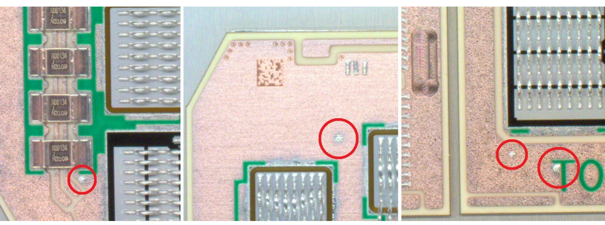
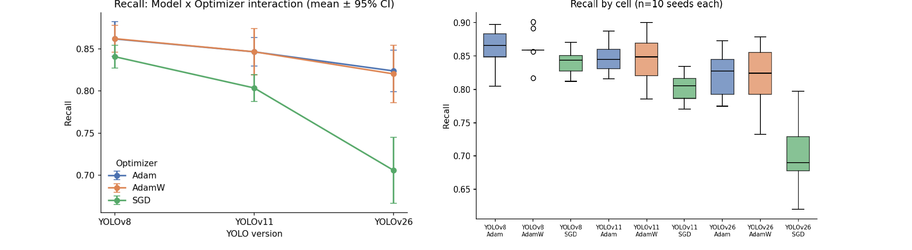
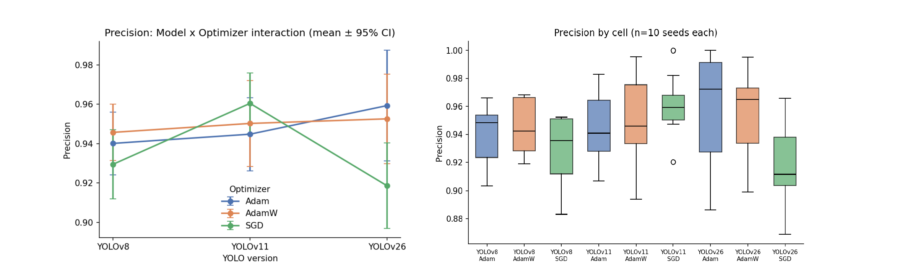

# Statistical Comparison of YOLO Architecture and Optimizer Choice for PCB Soldering-Splash Detection


A fully reproducible statistical evaluation of **three YOLO architectures** (YOLOv8, YOLO11, YOLO26) crossed with **three optimizers** (Adam, AdamW, SGD) for automated detection of soldering splashes on power-electronics printed circuit boards (PCBs). Every one of the 9 model×optimizer combinations was retrained from **10 independent random seeds** (90 runs total), and every conclusion is backed by two-way ANOVA with normality and homogeneity-of-variance screening — not a single-run point estimate.

<p align="center">
  
</p>
<p align="center"><sub>Representative solder-splash defects on the inspected PCBs (reproduced, CC BY 4.0, from Klčo et al., <i>Sci. Rep.</i> 13:20657, 2023).</sub></p>

## Why this exists

Most PCB-defect-detection papers pick one YOLO version and one optimizer, train it once, and report the resulting numbers. That leaves two questions unanswered: is the observed difference between configurations real, or just seed-to-seed noise — and does the best optimizer even stay the same across architectures? This project runs the full factorial design needed to answer both, and reports the result the way a designed experiment should be reported: with normality tests, variance-homogeneity checks, effect sizes, and post-hoc comparisons, cross-validated against non-parametric and variance-robust alternatives wherever a classical-ANOVA assumption is violated.

## Key findings

- **Architecture × optimizer interaction is statistically significant for all five metrics** (precision, recall, mAP@50, mAP@50-95, F1; all p < 0.05) — there is no single "best" optimizer that holds across YOLO versions.
- **YOLOv26 + SGD is the configuration to avoid**: recall collapses to a mean of 0.706, against 0.77–0.86 for every other model×optimizer cell.
- **AdamW is the safest default**: never significantly worse than Adam on any metric, and reliably better than SGD across all three architectures.
- **Precision is comparatively insensitive** to model or optimizer choice in isolation (both n.s.), despite the significant interaction — recall is the metric that actually separates configurations.
- All classical-ANOVA conclusions were **independently confirmed** by Kruskal-Wallis and Welch-corrected ANOVA wherever Shapiro-Wilk or Levene's test flagged an assumption violation.

## Results

<p align="center">
  
</p>
<p align="center"><sub>Recall — the metric most sensitive to architecture and optimizer choice. The YOLOv26/SGD cell diverges sharply from every other combination.</sub></p>

<p align="center">
  
</p>
<p align="center"><sub>Precision, shown for contrast — neither the model nor the optimizer main effect is significant here, despite the significant interaction term.</sub></p>

### Two-way ANOVA summary (model × optimizer, df = (2,81)/(2,81)/(4,81))

| Metric | Model effect | Optimizer effect | Interaction |
|---|---|---|---|
| Precision | F=1.75, p=.180 | F=2.05, p=.135 | F=2.85, p=.029 |
| Recall | F=33.74, p<.0001 | F=30.42, p<.0001 | F=6.96, p<.0001 |
| mAP@50 | F=36.89, p<.0001 | F=22.02, p<.0001 | F=14.20, p<.0001 |
| mAP@50-95 | F=31.12, p<.0001 | F=39.43, p<.0001 | F=16.42, p<.0001 |
| F1 Score | F=27.00, p<.0001 | F=33.48, p<.0001 | F=10.33, p<.0001 |

Full breakdown (Shapiro-Wilk, Levene, Tukey HSD, Kruskal-Wallis, Welch ANOVA, and the model×optimizer cell-level post-hoc table) is in [`statistical_report.pdf`](./Complete_statistical__report.pdf).

## Experimental design

| | |
|---|---|
| **Architectures** | YOLOv8, YOLO11, YOLO26 |
| **Optimizers** | Adam, AdamW, SGD |
| **Seeds per cell** | 10 (0, 7, 11, 69, 111, 555, 999, 1488, 2222, 3333) |
| **Total runs** | 90 (balanced, n = 10 per cell) |
| **Metrics** | Precision, Recall, mAP@50, mAP@50-95, F1 score |
| **Evaluation** | Held-out validation split, best-checkpoint weights |
| **Statistical pipeline** | Shapiro-Wilk → Levene's test → two-way ANOVA (+ interaction) → Tukey HSD, with Kruskal-Wallis / Welch ANOVA fallback wherever an assumption was violated |

The methodology mirrors the two-way ANOVA design used in prior work from this group on preprocessing-method comparison for the same dataset [2].

## Repository contents

| File | Description |
|---|---|
| [`Complete_statistical__report.pdf`](./Complete_statistical__report.pdf) | Full 10-section statistical analysis report: normality screening, Levene's test, two-way ANOVA, Tukey HSD, Kruskal-Wallis, Welch ANOVA, and all interaction-plot/boxplot figures for all five metrics. |
| [`descriptive_statistics.xlsx`](./descriptive_statistics.csv) | Descriptive statistics (mean, median, SD, min/max, quartiles) per model×optimizer cell for all five metrics. |
| `Figures/` | Figures used in this README. |

> **Note:** file names above match what's currently in this repo — rename the table row if your actual filenames differ.

## Citation

If you use this data or analysis, please cite:

```bibtex
@inproceedings{klco2026yolooptimizer,
  title     = {Statistical Comparison of YOLO Algorithm Versions and Training Optimizers in PCB Soldering Splashes Detection},
  author    = {Kl{\v{c}}o, Peter and Smetana, Milan and Koniar, Dusan and Harga{\v{s}}, Libor},
  year      = {2026},
  note      = {Conference paper, in press},
  institution = {University of {\v{Z}}ilina}
}
```

The two-way ANOVA methodology follows:

> P. Klčo, D. Koniar, L. Hargaš, and M. Paškala, "Comparison of preprocessing method impact on the detection of soldering splashes using different YOLOv8 versions," *Computation*, vol. 12, no. 11, p. 225, 2024. https://doi.org/10.3390/computation12110225

## Funding

This work was supported by grant KEGA 046ŽU-4/2026, "Making the teaching of electronics focused subjects more attractive as a key factor for increasing interest in studying electrical engineering programs."

## Authors

Peter Klčo, Milan Smetana, Dusan Koniar, Libor Hargaš — Department of Mechatronics and Electronics / Department of Theoretical Electrical Engineering and Biomedical Engineering, University of Žilina, Slovakia.

## License

This repository is released under the [MIT License](./LICENSE).
